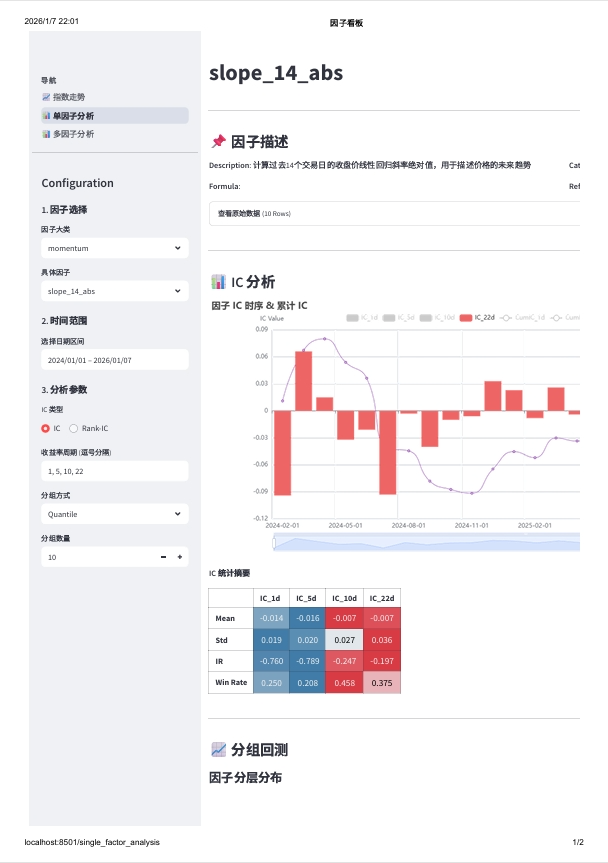
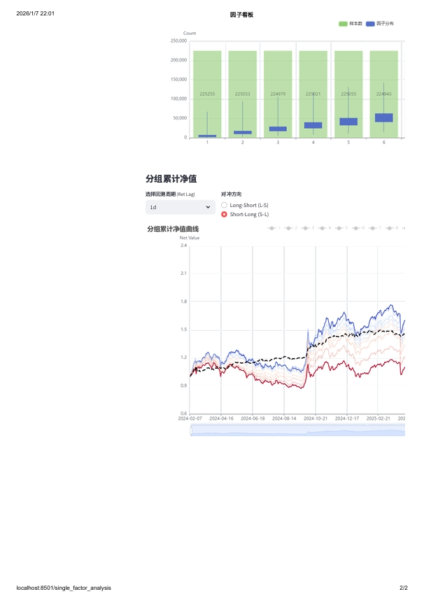

# 股票因子看板

## 连接
```
1. streamlit run 'dashboard\Home.py' --server.port 8501
2. ngrok http 8501
```
<br>


## 功能截图



<br>


## 数据
> 储存在 `data` 中，可手动加入, 也可通过掘金api获取
> 数据来源于掘金，一方面是因为可以直接开通实盘，另一方面是因为熟悉 :）  
> 
> 使用掘金需要配置 API，在根目录添加 `config.toml` 并配置 
> ``` 
> [gm.token]
> token = "your token"
> ```
> 执行 `src\data_loader\get_data.py`    # 获取全数据
> 执行 `src\factor_calc\get_factor.py`  # 获取因子数据
<br>

### 格式要求
- `price_data`

  - `type`: `pd.DataFrame`
  - `index`: `pd.MultiIndex(date, symbol)`
  - `columns`: [`open`, `high`, `low`, `close`, `volume`]
  - `dtype`: `float`

- `factor_data`

  - `type`: `pd.DataFrame`
  - `index`: `pd.MultiIndex(date, symbol)`
  - `columns`: [`factor_name`]
  - `dtype`: `float`

<br>

### 项目结构：
```
├── dashboard/      # Streamlit 前端
│ ├── views/        # 子页面
│ └── Home.py       # 前端展示执行页面
│
├── data/           # 本地缓存数据
│ ├── raw/          # 原始数据
│ ├── processed/    # 预处理后的数据（未实装）
│ └── factors/      # 因子数据
│
├── src/ # 核心代码
│ ├── data_loader/  # 数据获取（掘金）
│ ├── factor_calc/  # 因子计算模块（手动获取数据）
│ └── factor_eval/  # 因子评价模块
│
├── config.toml     # 配置文件（gm token）
├── requirements.txt 
├── README.md
└── run.py          # 主入口（未实装）
```

<br>

## TODO
1. 添加 `data\macro_factors` 的显示
2. 添加 `src\factor_eval\get_eval.py` 的 因子分组截面收益的评估
3. 添加 `data\raw` 的整理
4. 添加 `data\raw` 的数据预处理
5. 添加 `data\factors` 的因子显示时的前端因子预处理操作
6. 添加 `run.py` 的数据下载与因子计算全流程
